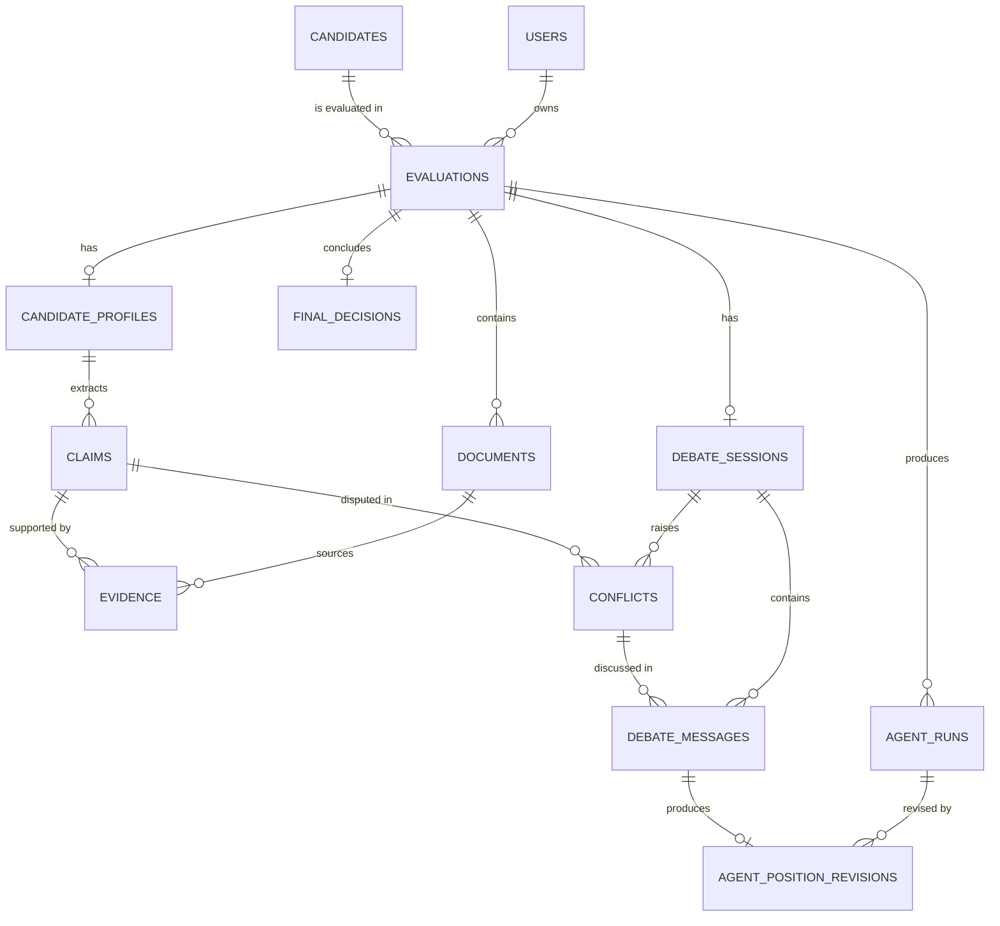

# Database Schema

## Verdict AI — Multi-Agent Candidate Intelligence & Hiring Debate System

> This document defines the persistence model for the product described in README.md and PRD.md. It is derived from the actual pipeline — document upload → candidate profile → evidence ledger → four independent agent runs → debate → position revisions → final deliberation → final report — not from generic database design patterns. Every table below exists because a real part of that pipeline needs it to have its own identity, relationship, query pattern, lifecycle, or audit trail.

---

## 1. Design Goals

- **Match the real pipeline, not an idealized one.** The schema mirrors the eight or nine things that actually happen to a candidate's data, in the order they happen.
- **Preserve independence as a fact, not a convention.** Agent isolation is the product's most important architectural guarantee (README §6, §10; PRD §10). The schema must make it possible to *prove*, after the fact, that no independent agent run could have seen another agent's output — not just trust that the application code behaved.
- **Never destroy reasoning history.** An agent revising its position, or a conflict getting resolved, must never overwrite the record of what was originally said. Auditability is a first-class requirement (README §21; PRD §11).
- **Normalize what needs independent life; JSONB what doesn't.** A piece of data gets its own table only if it needs to be queried, referenced, or change independently of its parent. Otherwise it stays as JSONB on the record that owns it.
- **Optimize for one query: "load this evaluation."** The dominant read pattern in this product is opening a single evaluation and rendering everything about it — profile, evidence, four agent opinions, debate, final decision. The schema is shaped around making that fast and simple, not around theoretical normalization purity.
- **Stay buildable in a hackathon timeframe.** Thirteen tables, no event-sourcing, no generic "activity log" abstraction, no premature multi-tenant scaffolding beyond a minimal `users` table.

---

## 2. Design Decisions

**Evaluation is the central aggregate, not Candidate.** A `candidate` is just an identity — a person who may be evaluated more than once, for more than one role (PRD §9.2, README's Candidate Profile section). Everything the pipeline actually produces — documents, profile, claims, evidence, agent runs, debate, final decision — belongs to one `evaluations` row. This mirrors the README's own database sketch and keeps every downstream table scoped by a single `evaluation_id`, which is what makes "load one evaluation" a simple, indexed set of queries instead of a candidate-wide join.

**Claims and Evidence are separate tables, one level apart.** A **claim** is something the candidate asserts ("improved API performance by 40%"). **Evidence** is the literal quote and source location that backs it up ("Reduced API response time by 40% through Redis caching," resume, Experience section). README §4 and §5 model these as related-but-distinct concepts, and PRD §9.3 requires that any conclusion be traceable down to an exact quote — which only works if evidence is addressable on its own, independent of the claim it happens to support. A claim can be evidenced by more than one quote (e.g., mentioned in both resume and interview transcript), so `evidence` holds a foreign key to `claims`, not the other way around.

**Candidate Profile is a hybrid: one relational row per evaluation, one JSONB payload for its structure.** The profile's internal shape (education, skills, experience, projects, certifications) is produced as a single structured extraction, is always read as a whole for display, and never needs to be queried field-by-field across candidates in this version of the product. Normalizing "skills" or "experience" into their own tables would add eight-plus tables for zero real query benefit. The one exception is **claims**, which are pulled out of the profile JSON into their own table — because claims, unlike skills, need to be independently referenced by evidence, by agent findings, by debate conflicts, and by the risk map, and need their own status lifecycle (`UNVERIFIED → WELL_SUPPORTED`, etc.).

**Agent output is relational metadata + one JSONB blob per run.** README §8 defines a strict, Zod-validated `AgentOpinion` structure. That entire validated object is stored as JSONB on `agent_runs`, because it is produced and consumed as a single unit and the UI always renders it whole. What's pulled out relationally is exactly what needs independent querying: which agent, which evaluation, what stage, what status, what recommendation, what confidence — the fields conflict detection and the debate engine actually filter and join on.

**Agent independence is represented structurally, not just by convention.** `agent_runs` rows are the only input the debate stage is allowed to read, and they are written once, by isolated, parallel calls, before any conflict is computed. There is no foreign key or column on `agent_runs` that could reference another agent's run — the isolation guarantee comes from the fact that nothing in the independent-run write path has access to sibling rows. The unique constraint `(evaluation_id, agent_type)` on completed runs then makes it structurally provable, after the fact, that exactly one independent evaluation exists per agent per evaluation, and its `created_at`/`completed_at` timestamps can be checked against `debate_sessions.started_at` to confirm ordering.

**Revisions are new, immutable rows — never updates to the original run.** README §10, Rule 6, and PRD §9.11 require that a revised position be visible *alongside* the original, not in place of it. Updating `agent_runs.output` in place would destroy the "before" state that makes the debate meaningful and auditable. Instead, `agent_position_revisions` is an append-only table: every revision is a new row referencing the original `agent_runs` row it revises and the `debate_messages` row that triggered it. The original `agent_runs` row is never mutated after it's marked `COMPLETED`.

**Debate is modeled as messages, not a single text blob.** PRD §12 explicitly requires that the debate expose direct responses, challenges, agreements, and revisions as distinct, inspectable interactions — a single "debate transcript" text field would make the UI's debate room (PRD §16) and the Voice Hiring Room (PRD §9.16) impossible to build correctly. `debate_messages` gives each turn a speaker, an optional target, a type, and structured content, while staying a single flat table rather than a modeled "conversation graph" — there's no need for anything more elaborate than a sequence number within a debate session.

**No separate Final Report table.** PRD §9.13 describes the final report as a presentation of the final decision plus everything that led to it. Nothing about a "report" changes independently of `final_decisions`, `agent_runs`, `debate_messages`, and `claims` — it is a rendered view, not new data. Creating a table for it would mean keeping a second copy of data in sync with its source for no benefit. If a persisted, immutable export/snapshot becomes a real requirement later (e.g., "share this exact report with a hiring committee, frozen in time"), that's a good candidate for a future `report_exports` table holding a JSONB snapshot — but it is not needed for the current product and is intentionally left out (see §13).

**Interview questions and the risk map are not separate tables.** Interview verification questions (PRD §9.15) are generated once, as part of final deliberation, and are always viewed alongside the final decision — they live as a JSONB array on `final_decisions`, each entry referencing the `claim_id` it targets. The Claim Confidence / Risk Map (PRD §9.14) is not a table at all — it's a query: `claims` joined with their `evidence`, the `conflicts` that reference them, and their current `status`. Storing it separately would just be a cache of a cheap join.

---

## 3. Core Entity Overview

| Table | Represents | Cardinality relative to Evaluation |
|---|---|---|
| `users` | An authenticated recruiter/HR user of the platform | many evaluations per user |
| `candidates` | The person being evaluated (identity only) | many evaluations per candidate |
| `evaluations` | One complete hiring analysis of one candidate against one role | the central aggregate |
| `documents` | An uploaded file (resume, transcript, JD, interview transcript) | many per evaluation |
| `candidate_profiles` | The structured profile extracted from documents | exactly one per evaluation |
| `claims` | An individually evaluable statement the candidate makes | many per evaluation |
| `evidence` | An exact quote + source location backing a claim | many per claim |
| `agent_runs` | One independent AI agent's evaluation | exactly four per evaluation (one per agent type) |
| `agent_position_revisions` | An immutable record of an agent changing its position during debate | zero or more per agent run |
| `debate_sessions` | The debate stage for an evaluation | exactly one per evaluation |
| `conflicts` | A detected disagreement the debate must address | many per debate session |
| `debate_messages` | One turn in the debate (challenge, response, etc.) | many per debate session |
| `final_decisions` | The output of the Final Deliberation stage | exactly one per evaluation |

Thirteen tables. No table exists purely to hold denormalized copies of data that lives elsewhere.

---

## 4. Entity Relationship Diagram



---

## 5. Detailed Table Specifications

### `users`

**Purpose.** Represents an authenticated recruiter, hiring manager, or HR user of the platform.

**Why this table exists.** PRD §18 requires that candidate data only be accessible to authorized users, and evaluations need an owner. Kept deliberately minimal — this is not an identity/auth system, just the record authorization and ownership hang off of.

| Column | PostgreSQL Type | Required | Description | Constraints |
|---|---|---|---|---|
| `id` | `UUID` | Yes | Primary key | `PRIMARY KEY DEFAULT gen_random_uuid()` |
| `email` | `TEXT` | Yes | Login/contact email | `UNIQUE NOT NULL` |
| `full_name` | `TEXT` | Yes | Display name | `NOT NULL` |
| `created_at` | `TIMESTAMPTZ` | Yes | Account creation time | `NOT NULL DEFAULT now()` |

**Relationships.** One user owns many `evaluations`.

**Indexes.** `UNIQUE` index on `email` (login lookup).

**Notes.** Password/session handling, SSO, and roles are authentication implementation details and are explicitly out of scope for this document (per the task's stated scope). If the product ends up not requiring multi-user login for the prototype, this table can be dropped and `evaluations.user_id` made nullable without touching anything else.

---

### `candidates`

**Purpose.** Represents the person being evaluated, as an identity distinct from any one evaluation of them.

**Why this table exists.** PRD §9.2 and the README both treat a candidate as potentially having multiple evaluations against different roles. Keeping identity separate from evaluation avoids re-entering the same person's name/contact info per role and gives a natural place to list "all evaluations of this candidate" later.

| Column | PostgreSQL Type | Required | Description | Constraints |
|---|---|---|---|---|
| `id` | `UUID` | Yes | Primary key | `PRIMARY KEY DEFAULT gen_random_uuid()` |
| `full_name` | `TEXT` | Yes | Candidate's name | `NOT NULL` |
| `email` | `TEXT` | No | Candidate's contact email, if known | — |
| `created_at` | `TIMESTAMPTZ` | Yes | First time this candidate was created in the system | `NOT NULL DEFAULT now()` |

**Relationships.** One candidate has many `evaluations`.

**Indexes.** Index on `email` for candidate lookup/dedup when starting a new evaluation.

**Notes.** Deliberately does **not** store extracted resume data (skills, degree, experience) — that belongs to the evaluation-scoped `candidate_profiles` table, because the profile is a product of documents attached to one evaluation, not a durable fact about the person. Two evaluations of the same candidate, months apart with an updated resume, should have two independent profiles.

---

### `evaluations`

**Purpose.** The central aggregate: one complete hiring analysis of one candidate against one role.

**Why this table exists.** This is the parent every other pipeline table hangs off of. It's what "opening an evaluation" in the UI actually loads.

| Column | PostgreSQL Type | Required | Description | Constraints |
|---|---|---|---|---|
| `id` | `UUID` | Yes | Primary key | `PRIMARY KEY DEFAULT gen_random_uuid()` |
| `candidate_id` | `UUID` | Yes | The candidate being evaluated | `NOT NULL REFERENCES candidates(id)` |
| `user_id` | `UUID` | No | Owning/creating user | `REFERENCES users(id)` |
| `role_title` | `TEXT` | No | Target role name, if a JD was provided | — |
| `status` | `TEXT` | Yes | Pipeline stage the evaluation is in | `NOT NULL CHECK (status IN ('DOCUMENTS_PENDING','PROCESSING','PROFILE_READY','AGENTS_RUNNING','AGENT_FAILED','AGENTS_COMPLETE','DEBATE_IN_PROGRESS','DEBATE_COMPLETE','DELIBERATING','COMPLETE','FAILED'))` |
| `created_at` | `TIMESTAMPTZ` | Yes | Evaluation created | `NOT NULL DEFAULT now()` |
| `updated_at` | `TIMESTAMPTZ` | Yes | Last state change | `NOT NULL DEFAULT now()` |

**Relationships.** Belongs to one `candidate` and (optionally) one `user`. Parent of `documents`, `candidate_profiles`, `claims`, `agent_runs`, `debate_sessions`, `final_decisions`.

**Indexes.** Index on `candidate_id` (list evaluations for a candidate). Index on `user_id` (recruiter's evaluation list). Index on `status` (dashboards/queues, e.g. "evaluations awaiting review"). Index on `created_at` (recency sort).

**Notes.** `status` is the single source of truth for "what stage is this evaluation at," and drives the real processing-state UI required by PRD §16/§19 ("do not fake progress"). Application logic transitions this field; see §7 for the pipeline-ordering rules it must respect.

---

### `documents`

**Purpose.** Metadata for an uploaded file — resume, transcript, job description, or interview/assessment transcript.

**Why this table exists.** PRD §9.1 requires tracking upload status and validation per file, and every extracted claim/evidence must cite its source document.

| Column | PostgreSQL Type | Required | Description | Constraints |
|---|---|---|---|---|
| `id` | `UUID` | Yes | Primary key | `PRIMARY KEY DEFAULT gen_random_uuid()` |
| `evaluation_id` | `UUID` | Yes | Parent evaluation | `NOT NULL REFERENCES evaluations(id) ON DELETE CASCADE` |
| `document_type` | `TEXT` | Yes | What kind of document this is | `NOT NULL CHECK (document_type IN ('RESUME','TRANSCRIPT','JOB_DESCRIPTION','INTERVIEW_TRANSCRIPT'))` |
| `original_filename` | `TEXT` | Yes | Filename as uploaded | `NOT NULL` |
| `storage_path` | `TEXT` | Yes | Path/URI in object storage (not the file itself) | `NOT NULL` |
| `mime_type` | `TEXT` | Yes | Validated MIME type | `NOT NULL` |
| `file_size_bytes` | `BIGINT` | Yes | File size | `NOT NULL CHECK (file_size_bytes > 0)` |
| `checksum_sha256` | `TEXT` | No | Content hash, for dedup / integrity | — |
| `status` | `TEXT` | Yes | Ingestion status | `NOT NULL DEFAULT 'UPLOADED' CHECK (status IN ('UPLOADED','PROCESSING','PROCESSED','FAILED'))` |
| `uploaded_at` | `TIMESTAMPTZ` | Yes | Upload time | `NOT NULL DEFAULT now()` |
| `processed_at` | `TIMESTAMPTZ` | No | When ingestion completed | — |

**Relationships.** Belongs to one `evaluation`. Referenced by `evidence.document_id`.

**Indexes.** Index on `evaluation_id` (load all documents for an evaluation). Index on `(evaluation_id, document_type)` (e.g., "get the resume for this evaluation").

**Notes.** The raw file lives in object storage (S3/GCS), never in the database — this table stores only the reference and metadata, per the task's explicit requirement. `checksum_sha256` supports the efficiency requirement in README §22 ("reuse extracted Candidate Profile if same documents") by making it possible to detect whether an uploaded document is byte-identical to one already processed elsewhere.

---

### `candidate_profiles`

**Purpose.** The single normalized, structured representation of the candidate, generated from their documents — the shared source of facts every agent reads.

**Why this table exists.** README §4 requires this to be "the only source of shared candidate facts used by all agents." One row per evaluation gives every downstream stage one unambiguous place to read from.

| Column | PostgreSQL Type | Required | Description | Constraints |
|---|---|---|---|---|
| `id` | `UUID` | Yes | Primary key | `PRIMARY KEY DEFAULT gen_random_uuid()` |
| `evaluation_id` | `UUID` | Yes | Parent evaluation | `NOT NULL UNIQUE REFERENCES evaluations(id) ON DELETE CASCADE` |
| `profile_data` | `JSONB` | Yes | Education, skills, experience, projects, certifications (see §6) | `NOT NULL` |
| `extraction_model` | `TEXT` | Yes | Model used to extract the profile (e.g. `gemini-1.5-pro`) | `NOT NULL` |
| `generated_at` | `TIMESTAMPTZ` | Yes | When extraction completed | `NOT NULL DEFAULT now()` |

**Relationships.** Belongs to one `evaluation` (1:1). Parent of `claims`.

**Indexes.** `UNIQUE` index on `evaluation_id` (enforces one profile per evaluation; also the join key for loading it).

**Notes.** A GIN index on `profile_data` (`USING GIN (profile_data jsonb_path_ops)`) is worth adding only if the product later needs to search across candidates by skill/technology; not needed for the MVP's per-evaluation access pattern, so it is intentionally omitted for now.

---

### `claims`

**Purpose.** An individually evaluable statement the candidate makes, pulled out of the profile so it can be referenced, evidenced, disputed, and tracked through a status lifecycle.

**Why this table exists.** PRD §9.14 (Risk Map) and README §5 require every claim to carry an independent trust status, be linked to evidence, and be referenceable from agent findings and debate conflicts — none of which is possible if claims stay buried inside the profile JSON.

| Column | PostgreSQL Type | Required | Description | Constraints |
|---|---|---|---|---|
| `id` | `UUID` | Yes | Primary key | `PRIMARY KEY DEFAULT gen_random_uuid()` |
| `evaluation_id` | `UUID` | Yes | Parent evaluation (denormalized from profile for simpler queries) | `NOT NULL REFERENCES evaluations(id) ON DELETE CASCADE` |
| `candidate_profile_id` | `UUID` | Yes | Profile this claim was extracted from | `NOT NULL REFERENCES candidate_profiles(id) ON DELETE CASCADE` |
| `claim_text` | `TEXT` | Yes | The claim as stated (e.g., "Improved API response time by 40%") | `NOT NULL` |
| `category` | `TEXT` | No | Claim category | `CHECK (category IN ('SKILL','EXPERIENCE','ACHIEVEMENT','LEADERSHIP','PROJECT','OTHER'))` |
| `status` | `TEXT` | Yes | Current trust status (the Risk Map value) | `NOT NULL DEFAULT 'UNVERIFIED' CHECK (status IN ('VERIFIED','WELL_SUPPORTED','PARTIALLY_SUPPORTED','UNVERIFIED','CONTRADICTED'))` |
| `status_updated_at` | `TIMESTAMPTZ` | No | Last time status changed (e.g., after debate/deliberation) | — |
| `created_at` | `TIMESTAMPTZ` | Yes | Extraction time | `NOT NULL DEFAULT now()` |

**Relationships.** Belongs to one `candidate_profile` (and, denormalized, one `evaluation`). Parent of `evidence`. Referenced by `conflicts.related_claim_id`.

**Indexes.** Index on `evaluation_id` (Risk Map query: all claims for this evaluation). Index on `(evaluation_id, status)` (Risk Map filtered/grouped by status). Index on `candidate_profile_id`.

**Notes.** `status` starts as `UNVERIFIED` at extraction time and is updated once — after Final Deliberation — to its settled value, based on agent findings, debate outcomes, and conflict resolution concerning that claim. It is not recomputed on every agent run; it reflects the pipeline's final judgment, which is what the Risk Map is supposed to show.

---

### `evidence`

**Purpose.** An exact, source-linked quote that supports a claim — the atomic unit of the Evidence Ledger.

**Why this table exists.** This is the product's core differentiator (README §5 "Killer Feature #1"; PRD §9.3). Every conclusion in the product must resolve, in one or two clicks, down to a row in this table.

| Column | PostgreSQL Type | Required | Description | Constraints |
|---|---|---|---|---|
| `id` | `UUID` | Yes | Primary key | `PRIMARY KEY DEFAULT gen_random_uuid()` |
| `evaluation_id` | `UUID` | Yes | Parent evaluation (denormalized for simpler queries) | `NOT NULL REFERENCES evaluations(id) ON DELETE CASCADE` |
| `claim_id` | `UUID` | No | The claim this evidence supports | `REFERENCES claims(id) ON DELETE CASCADE` |
| `document_id` | `UUID` | Yes | Source document the quote came from | `NOT NULL REFERENCES documents(id) ON DELETE CASCADE` |
| `quote_text` | `TEXT` | Yes | The exact extracted quote | `NOT NULL` |
| `location` | `JSONB` | No | Free-form location metadata, e.g. `{"section": "Experience"}` | — |
| `created_at` | `TIMESTAMPTZ` | Yes | Extraction time | `NOT NULL DEFAULT now()` |

**Relationships.** Belongs to one `document`, optionally belongs to one `claim`. Referenced by agent findings and debate content via `evidence_id` values stored inside their JSONB payloads (see notes below on how that reference is validated).

**Indexes.** Index on `evaluation_id` (evidence ledger for the whole evaluation). Index on `claim_id` (all evidence for a given claim — the click-through path). Index on `document_id`.

**Notes.** `claim_id` is nullable because some evidence supports a general agent finding rather than one specific extracted claim (e.g., a quote used only by the HR agent to assess communication tone). `location` is JSONB rather than separate `section`/`page` columns because it's optional, free-form, and never filtered on — it exists purely for display. Agent findings, debate challenges, and final-decision strengths/concerns reference evidence by `evidence_id` **inside their own JSONB payloads**, not through a database foreign key — those payloads are validated at write time (Zod, per README §8) to only ever cite `evidence_id`s that exist in this table for the same evaluation. This keeps the ledger itself simple and relational while still guaranteeing every citation is real.

---

### `agent_runs`

**Purpose.** One independent AI agent's evaluation of the candidate — the record that proves independence.

**Why this table exists.** This is where the product's central architectural guarantee lives. README §6, §10; PRD §10.

| Column | PostgreSQL Type | Required | Description | Constraints |
|---|---|---|---|---|
| `id` | `UUID` | Yes | Primary key | `PRIMARY KEY DEFAULT gen_random_uuid()` |
| `evaluation_id` | `UUID` | Yes | Parent evaluation | `NOT NULL REFERENCES evaluations(id) ON DELETE CASCADE` |
| `agent_type` | `TEXT` | Yes | Which persona | `NOT NULL CHECK (agent_type IN ('TECHNICAL','HR_CULTURE','HIRING_MANAGER','SKEPTIC'))` |
| `status` | `TEXT` | Yes | Execution status | `NOT NULL DEFAULT 'PENDING' CHECK (status IN ('PENDING','RUNNING','COMPLETED','FAILED'))` |
| `retry_count` | `INTEGER` | Yes | Automated retry attempts consumed so far (max 2 before `status` becomes `FAILED`) | `NOT NULL DEFAULT 0 CHECK (retry_count >= 0)` |
| `model_name` | `TEXT` | No | Model used (e.g. `gemini-1.5-pro`) | — |
| `prompt_version` | `TEXT` | No | Version tag of the persona prompt used | — |
| `recommendation` | `TEXT` | No | This agent's recommendation (vocabulary differs by agent type; stored as text, validated at the application layer) | — |
| `confidence` | `NUMERIC(4,3)` | No | This agent's stated confidence, `0.000`–`1.000` | `CHECK (confidence IS NULL OR (confidence >= 0 AND confidence <= 1))` |
| `output` | `JSONB` | No | Full validated `AgentOpinion` structure (see §6) | — |
| `started_at` | `TIMESTAMPTZ` | No | Call start | — |
| `completed_at` | `TIMESTAMPTZ` | No | Call completion | — |
| `created_at` | `TIMESTAMPTZ` | Yes | Row creation | `NOT NULL DEFAULT now()` |

**Relationships.** Belongs to one `evaluation`. Parent of `agent_position_revisions`. Referenced by `debate_messages.speaker_agent_type` / `target_agent_type` (logically, via `agent_type` + `evaluation_id`, not a direct FK — see notes).

**Indexes.** `UNIQUE` index on `(evaluation_id, agent_type)` (exactly one independent run per agent per evaluation — this is the constraint that makes independence structurally checkable). Index on `(evaluation_id, status)` (drives the "waiting on N agents" UI state).

**Notes.** `output` is only written once, when `status` transitions to `COMPLETED`, and is never modified afterward — any change in position is captured as a new row in `agent_position_revisions`, not an update here. `debate_messages` and `agent_position_revisions` reference agents by `(evaluation_id, agent_type)` rather than `agent_runs.id` directly by foreign key, because the debate layer conceptually addresses "the Technical Agent in this evaluation," and the unique constraint above guarantees that resolves to exactly one row — a lightweight application-level join, not a missing constraint. `retry_count` is incremented on each automated retry of that agent; once it reaches 2 without the call succeeding, the row is marked `FAILED` and the parent `evaluations.status` moves to `AGENT_FAILED` (see §14, Rule 6). A manual retry from the UI resets that row to `PENDING`/`retry_count = 0` and re-executes only that agent — the other three `COMPLETED` rows are untouched, preserving their independence guarantee (they were never shown the retried agent's output either).

---

### `agent_position_revisions`

**Purpose.** An immutable record of an agent changing (or partially changing, or explicitly maintaining) its position in response to a debate challenge.

**Why this table exists. **PRD §9.11 and README Rule 6 require the initial position and any revision to both remain visible. Recommendation: **separate immutable rows referencing the original run**, not an update to `agent_runs`. Reasoning: updating `agent_runs.output` in place would make it impossible to answer "what did the Technical Agent originally think before the Skeptic challenged it?" — which is precisely the before/after story the debate room UI (PRD §16) exists to show. An append-only table also naturally supports multiple rounds of revision without any schema change.

| Column | PostgreSQL Type | Required | Description | Constraints |
|---|---|---|---|---|
| `id` | `UUID` | Yes | Primary key | `PRIMARY KEY DEFAULT gen_random_uuid()` |
| `agent_run_id` | `UUID` | Yes | The original independent run being revised | `NOT NULL REFERENCES agent_runs(id) ON DELETE CASCADE` |
| `debate_message_id` | `UUID` | No | The debate message (type `REVISION`) that this record represents | `REFERENCES debate_messages(id) ON DELETE SET NULL` |
| `revision_type` | `TEXT` | Yes | Nature of the change | `NOT NULL CHECK (revision_type IN ('FULL_REVISION','PARTIAL_REVISION','MAINTAINED_WITH_ADDITIONAL_EVIDENCE'))` |
| `revised_recommendation` | `TEXT` | No | New recommendation, if changed | — |
| `revised_confidence` | `NUMERIC(4,3)` | No | New confidence, if changed | `CHECK (revised_confidence IS NULL OR (revised_confidence >= 0 AND revised_confidence <= 1))` |
| `reasoning` | `TEXT` | Yes | Why the position changed (or didn't) | `NOT NULL` |
| `output` | `JSONB` | No | Full revised finding, if the revision affects structured findings | — |
| `created_at` | `TIMESTAMPTZ` | Yes | When the revision was recorded | `NOT NULL DEFAULT now()` |

**Relationships.** Belongs to one `agent_run`. Optionally linked to the `debate_message` that produced it.

**Indexes.** Index on `agent_run_id` (load full revision history for an agent, in `created_at` order).

**Notes.** Multiple rows can exist per `agent_run_id` if an agent's position is challenged more than once across debate rounds — the current position is simply the most recent revision row for that `agent_run_id`, or the original `agent_runs.output` if no revision exists yet.

---

### `debate_sessions`

**Purpose.** Represents the debate stage for one evaluation: its status and round-tracking.

**Why this table exists.** A natural, minimal parent for `conflicts` and `debate_messages`, and the place pipeline-ordering rules (debate can't start before all agents finish) attach to.

| Column | PostgreSQL Type | Required | Description | Constraints |
|---|---|---|---|---|
| `id` | `UUID` | Yes | Primary key | `PRIMARY KEY DEFAULT gen_random_uuid()` |
| `evaluation_id` | `UUID` | Yes | Parent evaluation | `NOT NULL UNIQUE REFERENCES evaluations(id) ON DELETE CASCADE` |
| `status` | `TEXT` | Yes | Debate stage status | `NOT NULL DEFAULT 'NOT_STARTED' CHECK (status IN ('NOT_STARTED','IN_PROGRESS','COMPLETED'))` |
| `round_count` | `INTEGER` | Yes | Rounds completed so far | `NOT NULL DEFAULT 0 CHECK (round_count >= 0)` |
| `max_rounds` | `INTEGER` | Yes | Round cap (README §11 recommends 2–3, hard cap 5) | `NOT NULL DEFAULT 5 CHECK (max_rounds > 0)` |
| `started_at` | `TIMESTAMPTZ` | No | Debate start time | — |
| `completed_at` | `TIMESTAMPTZ` | No | Debate completion time | — |

**Relationships.** Belongs to one `evaluation` (1:1). Parent of `conflicts` and `debate_messages`.

**Indexes.** `UNIQUE` index on `evaluation_id`.

**Notes.** If conflict detection finds no meaningful disagreements at all, the session can go straight from `NOT_STARTED` to `COMPLETED` with `round_count = 0` — the state machine doesn't require a debate to have happened, only to have been considered.

---

### `conflicts`

**Purpose.** A detected, meaningful disagreement the debate stage addresses — the priority topics for cross-examination.

**Why this table exists.** PRD §9.9 and §9.10 require conflicts to be detected before debate and tracked to a resolution status. This table is what the Adaptive Cross-Examination engine reads from and writes back to.

| Column | PostgreSQL Type | Required | Description | Constraints |
|---|---|---|---|---|
| `id` | `UUID` | Yes | Primary key | `PRIMARY KEY DEFAULT gen_random_uuid()` |
| `debate_session_id` | `UUID` | Yes | Parent debate session | `NOT NULL REFERENCES debate_sessions(id) ON DELETE CASCADE` |
| `conflict_type` | `TEXT` | Yes | Nature of the disagreement | `NOT NULL CHECK (conflict_type IN ('RECOMMENDATION_CONTRADICTION','CLAIM_DISAGREEMENT','EVIDENCE_INTERPRETATION_CONFLICT','HIGH_SEVERITY_CONCERN'))` |
| `description` | `TEXT` | Yes | Human-readable summary of the disagreement | `NOT NULL` |
| `agent_types` | `TEXT[]` | Yes | Agents involved in this conflict | `NOT NULL CHECK (cardinality(agent_types) >= 2)` |
| `related_claim_id` | `UUID` | No | Claim this conflict is about, if applicable | `REFERENCES claims(id) ON DELETE SET NULL` |
| `status` | `TEXT` | Yes | Resolution status | `NOT NULL DEFAULT 'UNRESOLVED' CHECK (status IN ('RESOLVED','PARTIALLY_RESOLVED','UNRESOLVED'))` |
| `created_at` | `TIMESTAMPTZ` | Yes | Detection time | `NOT NULL DEFAULT now()` |
| `resolved_at` | `TIMESTAMPTZ` | No | When status was last finalized | — |

**Relationships.** Belongs to one `debate_session`. Optionally linked to one `claim`. Parent of `debate_messages` (via `conflict_id`).

**Indexes.** Index on `debate_session_id`. Index on `status` (final report's "unresolved disagreements" query). GIN index on `agent_types` (`USING GIN (agent_types)`) to support "which conflicts involve the Skeptic."

**Notes.** `agent_types` is a plain array rather than a join table because a conflict typically involves exactly two agents and is never queried by "find all conflicts for this specific pair across evaluations" — array containment (`@>` / `ANY`) with a GIN index covers the real access pattern without the overhead of a `conflict_agents` join table.

---

### `debate_messages`

**Purpose.** One turn in the debate — a challenge, a response, an agreement, a disagreement, a defense, or a revision — preserving actual agent-to-agent interaction.

**Why this table exists.** PRD §12 is explicit that side-by-side opinions are not a debate; there must be inspectable, direct interaction. This table is the transcript, structured enough to drive the debate room UI and the Voice Hiring Room.

| Column | PostgreSQL Type | Required | Description | Constraints |
|---|---|---|---|---|
| `id` | `UUID` | Yes | Primary key | `PRIMARY KEY DEFAULT gen_random_uuid()` |
| `debate_session_id` | `UUID` | Yes | Parent debate session | `NOT NULL REFERENCES debate_sessions(id) ON DELETE CASCADE` |
| `conflict_id` | `UUID` | No | The conflict this message addresses | `REFERENCES conflicts(id) ON DELETE SET NULL` |
| `sequence_number` | `INTEGER` | Yes | Order within the debate session | `NOT NULL` |
| `speaker_agent_type` | `TEXT` | Yes | Who is speaking | `NOT NULL CHECK (speaker_agent_type IN ('TECHNICAL','HR_CULTURE','HIRING_MANAGER','SKEPTIC'))` |
| `target_agent_type` | `TEXT` | No | Who is being addressed, if applicable | `CHECK (target_agent_type IS NULL OR target_agent_type IN ('TECHNICAL','HR_CULTURE','HIRING_MANAGER','SKEPTIC'))` |
| `message_type` | `TEXT` | Yes | Interaction type | `NOT NULL CHECK (message_type IN ('CHALLENGE','RESPONSE','AGREEMENT','DISAGREEMENT','DEFENSE','REVISION'))` |
| `content` | `TEXT` | Yes | Human-readable message text | `NOT NULL` |
| `structured_content` | `JSONB` | No | Structured payload (target finding, evidence context — see §6) | — |
| `created_at` | `TIMESTAMPTZ` | Yes | Message time | `NOT NULL DEFAULT now()` |

**Relationships.** Belongs to one `debate_session`, optionally addresses one `conflict`. Optionally produces one `agent_position_revisions` row.

**Indexes.** `UNIQUE` index on `(debate_session_id, sequence_number)` (ordered transcript playback, and the mechanism the Voice Hiring Room's "jump to disagreement" feature relies on). Index on `conflict_id` (all messages for one conflict thread). Index on `(debate_session_id, speaker_agent_type)`.

**Notes.** `target_agent_type` is nullable because not every message targets a specific agent (e.g., a general opening statement), though in practice `CHALLENGE`, `RESPONSE`, and `DEFENSE` messages should always populate it — enforced at the application layer rather than a CHECK, since the "should" is type-dependent and easier to validate in the service that writes these rows.

---

### `final_decisions`

**Purpose.** The output of the Final Deliberation stage — the reasoned, non-averaged final recommendation.

**Why this table exists.** README §12–§13 and PRD §9.12–§9.13 require a distinct deliberation output, with a written rationale, that is not derivable by averaging `agent_runs.confidence`.

| Column | PostgreSQL Type | Required | Description | Constraints |
|---|---|---|---|---|
| `id` | `UUID` | Yes | Primary key | `PRIMARY KEY DEFAULT gen_random_uuid()` |
| `evaluation_id` | `UUID` | Yes | Parent evaluation | `NOT NULL UNIQUE REFERENCES evaluations(id) ON DELETE CASCADE` |
| `recommendation` | `TEXT` | Yes | Final recommendation | `NOT NULL CHECK (recommendation IN ('STRONG_HIRE','HIRE','INTERVIEW_RECOMMENDED','HOLD','REJECT'))` |
| `confidence_level` | `TEXT` | Yes | Qualitative confidence | `NOT NULL CHECK (confidence_level IN ('HIGH','MEDIUM','LOW'))` |
| `confidence_score` | `NUMERIC(4,3)` | No | Optional numeric confidence, `0.000`–`1.000` | `CHECK (confidence_score IS NULL OR (confidence_score >= 0 AND confidence_score <= 1))` |
| `reasoning` | `TEXT` | Yes | Written rationale explaining what mattered and why | `NOT NULL` |
| `strengths` | `JSONB` | Yes | Structured list of strengths (see §6) | `NOT NULL DEFAULT '[]'` |
| `concerns` | `JSONB` | Yes | Structured list of concerns (see §6) | `NOT NULL DEFAULT '[]'` |
| `verification_questions` | `JSONB` | Yes | Suggested interview questions (see §6) | `NOT NULL DEFAULT '[]'` |
| `model_name` | `TEXT` | No | Model used for deliberation | — |
| `created_at` | `TIMESTAMPTZ` | Yes | Deliberation completion time | `NOT NULL DEFAULT now()` |

**Relationships.** Belongs to one `evaluation` (1:1).

**Indexes.** `UNIQUE` index on `evaluation_id`. Index on `recommendation` if a future "list evaluations by outcome" view is needed (cheap to add now given the low cardinality, but not required for MVP access patterns — included for completeness rather than necessity).

**Notes.** Strengths, concerns, and verification questions are stored as JSONB rather than normalized tables because: (1) each is produced as one structured output from a single deliberation call, (2) each is only ever read as a whole alongside the rest of the final decision, and (3) none of them need independent querying across evaluations in this product. **Unresolved disagreements are deliberately not duplicated here** — they are queried directly from `conflicts WHERE status <> 'RESOLVED'` for this evaluation's debate session, which is the single source of truth for conflict status; the `reasoning` text is where the deliberation explains *why* specific unresolved conflicts mattered.

---

## 6. JSON / JSONB Structures

### `candidate_profiles.profile_data`

```json
{
  "education": {
    "degree": "B.S. Computer Science",
    "institution": "State University",
    "gpa": 3.7,
    "coursework": ["Data Structures", "Distributed Systems"],
    "certifications": ["AWS Certified Developer"]
  },
  "skills": {
    "languages": ["Python", "TypeScript"],
    "frameworks": ["FastAPI", "React"],
    "tools": ["Docker", "Git"],
    "cloud": ["AWS"],
    "databases": ["PostgreSQL", "Redis"],
    "other": ["System Design"]
  },
  "experience": [
    {
      "title": "Backend Engineering Intern",
      "organization": "Acme Corp",
      "duration": "Jun 2024 - Aug 2024",
      "description": "Built REST APIs using FastAPI and PostgreSQL"
    }
  ],
  "projects": [
    {
      "name": "Recommendation Engine",
      "description": "Built a scalable recommendation system"
    }
  ]
}
```

Justification: produced and consumed as a single unit; the UI always renders the whole profile; no field within it needs independent relational querying in this product.

### `agent_runs.output` (validated `AgentOpinion`)

```json
{
  "agentId": "technical",
  "recommendation": "YES",
  "confidence": 0.87,
  "strengths": [
    {
      "statement": "Demonstrates practical backend experience",
      "severity": null,
      "evidenceIds": ["<evidence-uuid-1>", "<evidence-uuid-2>"],
      "confidence": 0.87
    }
  ],
  "concerns": [
    {
      "statement": "Kubernetes proficiency is listed but not demonstrated",
      "severity": "medium",
      "evidenceIds": ["<evidence-uuid-3>"],
      "confidence": 0.6
    }
  ],
  "evidenceReferences": ["<evidence-uuid-1>", "<evidence-uuid-2>", "<evidence-uuid-3>"],
  "claimsToChallenge": ["<claim-uuid-1>"],
  "questionsForOtherAgents": []
}
```

Justification: this is exactly README §8's Zod-validated structure. Storing it whole avoids re-normalizing a schema the application already validates; `evidenceReferences` is what application code checks against `evidence.id` values for the same evaluation at write time.

### `debate_messages.structured_content`

```json
{
  "targetFinding": "FINDING_009",
  "challenge": "Which evidence proves depth beyond tool familiarity?",
  "evidenceContext": ["<evidence-uuid-1>", "<evidence-uuid-2>"]
}
```

Justification: mirrors README §10's challenge object exactly; only meaningful as a whole attached to its message row.

### `final_decisions.strengths` / `.concerns`

```json
[
  {
    "statement": "Strong backend implementation",
    "evidenceIds": ["<evidence-uuid-1>"],
    "supportingAgents": ["TECHNICAL", "HIRING_MANAGER"]
  }
]
```

### `final_decisions.verification_questions`

```json
[
  {
    "question": "Walk us through how you measured the reported 40% API performance improvement.",
    "claimId": "<claim-uuid-1>",
    "relatedConflictId": "<conflict-uuid-1>"
  }
]
```

Justification for both: each is a small, structured list produced once by the deliberation call and always displayed together as part of the final report; no item needs to be queried independent of its parent decision.

---

## 7. Data Integrity Rules

**Foreign keys and cascade behavior.**
- All evaluation-scoped tables (`documents`, `candidate_profiles`, `claims`, `evidence`, `agent_runs`, `debate_sessions`, `conflicts`, `debate_messages`, `agent_position_revisions`, `final_decisions`) cascade-delete when their `evaluation` is deleted (`ON DELETE CASCADE`), so deleting an evaluation cleanly removes everything derived from it with no orphans.
- `evaluations.candidate_id` and `evaluations.user_id` use `REFERENCES ... ` without cascade — deleting a candidate or user should not silently delete their evaluation history; see §11 for the recommended soft-delete approach.

**Uniqueness constraints.**
- `agent_runs (evaluation_id, agent_type)` — exactly one independent run per agent per evaluation. This is the constraint that makes agent independence structurally verifiable rather than merely asserted.
- `candidate_profiles.evaluation_id`, `debate_sessions.evaluation_id`, `final_decisions.evaluation_id` — each is a strict 1:1 with its evaluation.
- `debate_messages (debate_session_id, sequence_number)` — guarantees a well-defined, gap-free-in-practice ordering for transcript playback.

**Status/enum constraints.** Every status-like column uses a `CHECK (... IN (...))` constraint rather than relying on application code alone, per the task's explicit requirement not to rely only on frontend logic. If the product later needs to add a status value frequently, these can be migrated to native Postgres `ENUM` types — `CHECK` constraints are used here instead because they're simpler to alter in a fast-moving prototype (`ALTER TABLE ... DROP CONSTRAINT / ADD CONSTRAINT` vs. `ALTER TYPE`).

**Rules preventing invalid pipeline states.** These are sequencing rules the application layer must enforce (a database trigger could enforce the first two, but is not required for the prototype — noted as an optional hardening step):
1. A `debate_sessions` row may only move from `NOT_STARTED` to `IN_PROGRESS` once all four `agent_runs` for its `evaluation_id` have `status = 'COMPLETED'`. Enforced at the service layer by checking `COUNT(*) FROM agent_runs WHERE evaluation_id = ? AND status = 'COMPLETED'` equals 4 before transitioning debate status. There is no reduced-quorum exception — an evaluation with fewer than four `COMPLETED` runs can never enter debate, no matter how many retries have already been attempted on the missing agent(s).
2. A `final_decisions` row may only be created once `debate_sessions.status = 'COMPLETED'` for that evaluation.
3. `agent_position_revisions.agent_run_id` must reference an `agent_runs` row with `status = 'COMPLETED'` — an agent cannot "revise" a position it never independently reached.
4. `evidenceIds` cited inside `agent_runs.output`, `debate_messages.structured_content`, and `final_decisions.strengths/concerns` must all exist in `evidence` for the same `evaluation_id` — validated by the application's Zod schemas at write time before the JSONB is persisted, since Postgres cannot natively enforce foreign keys into JSONB array elements.
5. `evaluations.status` should only ever move forward through its `CHECK`-constrained value list (never backward) except into `FAILED`, which is enforced at the service layer, not the database — a strict forward-only `CHECK` would need the previous row value, which Postgres `CHECK` constraints cannot see, so this is intentionally left to application logic rather than forced into a database constraint that can't actually express it.
6. If any `agent_runs` row exhausts its retries (`retry_count` reaches 2) without reaching `COMPLETED`, the service layer sets that row's `status = 'FAILED'` and `evaluations.status = 'AGENT_FAILED'`. From `AGENT_FAILED`, the only forward transitions are back to `AGENTS_RUNNING` (a manual retry re-executes just the failed agent, resetting its row to `PENDING`) or into `FAILED` (evaluation abandoned). `AGENT_FAILED` is a distinct status from the terminal `FAILED` precisely so the UI can offer "retry the missing agent" rather than "start over."

---

## 8. Data Flow

1. A user creates an `evaluations` row (`status = 'DOCUMENTS_PENDING'`), linked to a `candidates` row (existing or newly created) and, if applicable, `user_id`.
2. The user uploads documents; each becomes a `documents` row (`status = 'UPLOADED'`). `evaluations.status` moves to `PROCESSING` once at least the resume and transcript are present.
3. Document ingestion runs; each `documents.status` moves through `PROCESSING` → `PROCESSED` (or `FAILED`).
4. The Candidate Profile Builder reads all `PROCESSED` documents and writes one `candidate_profiles` row, plus one `claims` row per extracted claim and one or more `evidence` rows per claim (each tagged with its source `document_id`). `evaluations.status` moves to `PROFILE_READY`.
5. Four `agent_runs` rows are created (`status = 'PENDING'`), one per `agent_type`. Each is executed as an isolated, independent call — receiving only `candidate_profiles.profile_data`, the relevant `claims`/`evidence`, and the job description text, never another agent's row. `evaluations.status` moves to `AGENTS_RUNNING`.
6. As each call completes, its `agent_runs.status` becomes `COMPLETED` and `output`/`recommendation`/`confidence` are written. If a call fails, `retry_count` is incremented and the call is retried, up to 2 retries; if it still fails, that row's `status` becomes `FAILED` and `evaluations.status` moves to `AGENT_FAILED`, halting the pipeline until the user manually retries the failed agent (which re-runs only that agent). Once all four rows for the evaluation are `COMPLETED` (enforced per Rule 1 in §7 — no reduced-quorum path), `evaluations.status` moves to `AGENTS_COMPLETE`.
7. Conflict detection reads all four `agent_runs.output` values for the evaluation and writes `conflicts` rows for meaningful disagreements. A `debate_sessions` row is created (or reused) and moved to `IN_PROGRESS`; `evaluations.status` moves to `DEBATE_IN_PROGRESS`.
8. For each conflict, the debate engine writes `debate_messages` rows in sequence — `CHALLENGE`, then `RESPONSE`/`DEFENSE`/`AGREEMENT`/`DISAGREEMENT`, and optionally further rounds up to `debate_sessions.max_rounds`.
9. When an agent revises its position, a new `agent_position_revisions` row is written, referencing the original `agent_runs.id` and the triggering `debate_messages.id` — the original `agent_runs.output` is never modified.
10. Each `conflicts.status` is finalized to `RESOLVED`, `PARTIALLY_RESOLVED`, or `UNRESOLVED` as its thread of `debate_messages` concludes. When all conflicts have a final status (or none were detected), `debate_sessions.status` moves to `COMPLETED`; `evaluations.status` moves to `DEBATE_COMPLETE`.
11. The Final Deliberator reads the `candidate_profiles`, `claims`/`evidence`, all four `agent_runs` (plus any `agent_position_revisions`), and all `conflicts`/`debate_messages`, and writes one `final_decisions` row. `evaluations.status` moves to `DELIBERATING` then `COMPLETE` once the row is written.
12. As part of the same deliberation step, each affected `claims.status` is updated to its settled Risk Map value (`VERIFIED`, `WELL_SUPPORTED`, `PARTIALLY_SUPPORTED`, `UNVERIFIED`, or `CONTRADICTED`), with `status_updated_at` set.
13. The Final Report is assembled at read time by joining `evaluations` → `candidate_profiles` → `claims`/`evidence` → `agent_runs`/`agent_position_revisions` → `debate_sessions`/`conflicts`/`debate_messages` → `final_decisions`. No separate write happens for "the report" — it is rendered, not persisted.

---

## 9. Query and Index Strategy

The dominant query in this product is: **a user opens one evaluation and needs everything about it.** Every index below exists to serve either that query or a specific, named UI feature.

| Query | Index used | Why |
|---|---|---|
| Load documents for an evaluation | `documents(evaluation_id)` | Populates the upload/processing panel |
| Get the resume/transcript specifically | `documents(evaluation_id, document_type)` | Profile builder and evidence display need "the resume," not "all documents" |
| Load the profile for an evaluation | `candidate_profiles(evaluation_id)` UNIQUE | Single-row lookup, always needed first |
| Risk Map: all claims + status for an evaluation | `claims(evaluation_id, status)` | Powers PRD §9.14's status-grouped view directly |
| Click-through from a claim to its evidence | `evidence(claim_id)` | The Evidence Ledger's core interaction (README §5) |
| All evidence in an evaluation (ledger view) | `evidence(evaluation_id)` | Full ledger inspection |
| "Are all four agents done yet?" | `agent_runs(evaluation_id, status)` | Drives processing-state UI (PRD §16/§19) and the debate-start rule |
| Enforce one run per agent per evaluation | `agent_runs(evaluation_id, agent_type)` UNIQUE | Structural independence guarantee |
| Revision history for one agent | `agent_position_revisions(agent_run_id)` | "Show original vs. revised position" in the debate room |
| Unresolved disagreements for the final report | `conflicts(status)` scoped by the evaluation's `debate_session_id` | Directly answers PRD's "expose unresolved disagreements" requirement |
| Which conflicts involve a given agent | `conflicts` GIN index on `agent_types` | Debate room filtering by persona |
| Ordered debate transcript playback | `debate_messages(debate_session_id, sequence_number)` UNIQUE | Transcript rendering and Voice Hiring Room's "jump to" navigation |
| All messages about one disagreement | `debate_messages(conflict_id)` | Debate room's per-conflict thread view |
| Final decision for an evaluation | `final_decisions(evaluation_id)` UNIQUE | Single-row lookup for the decision dossier |
| Recruiter's evaluation list | `evaluations(user_id)`, `evaluations(status)`, `evaluations(created_at)` | Dashboard/queue views |
| Candidate's evaluation history | `evaluations(candidate_id)` | "All evaluations of this person" |

**Efficiently loading a complete evaluation** means seven to eight indexed, `evaluation_id`-scoped queries run in parallel (documents, profile, claims+evidence, agent runs, debate session+conflicts+messages, final decision) rather than one enormous join — this keeps each query simple, cache-friendly, and independently retryable, which matters because different parts of the pipeline finish at different times and the UI needs to render partial state (per PRD §19's "no faked progress" requirement) while later stages are still running.

---

## 10. Auditability and Versioning

- **Independent opinions are permanent.** `agent_runs.output` is written once and never updated after `status = 'COMPLETED'`. This is the historical record that proves what each agent actually concluded before seeing any other opinion.
- **Revisions are additive, not destructive.** `agent_position_revisions` never overwrites `agent_runs`; it appends. The full sequence `agent_runs.output` → `agent_position_revisions` (ordered by `created_at`) reconstructs the complete "before → challenge → after" story for any agent.
- **The debate transcript is immutable once written.** `debate_messages` rows are never edited or deleted (application code should only ever `INSERT` into this table) — the sequence numbering makes the transcript replayable exactly as it happened.
- **Conflict resolution status changes are timestamped, not history-tracked.** `conflicts.status` does update in place (unlike agent positions), because a conflict has one current resolution state, not competing "versions" of itself. What preserves the reasoning is the underlying `debate_messages` thread (`conflict_id`), which is never deleted — so "why was this marked Partially Resolved?" is always answerable by reading that thread, not by a separate status-history table.
- **Evidence is never edited after extraction.** `evidence.quote_text` is treated as a direct extraction from a specific document and is immutable — if a re-extraction is ever needed (e.g., improved parsing), it produces new `evidence` rows rather than mutating old ones, preserving what any existing agent finding or debate message actually cited at the time.
- **Claim status changes are the one intentional exception to "never update."** `claims.status` is updated once, after Final Deliberation, from its initial `UNVERIFIED` default to its settled value — this is a deliberate simplification (see §13) rather than a gap: the full reasoning behind *why* a claim ended up `PARTIALLY_SUPPORTED` still lives in the immutable `agent_runs`, `debate_messages`, and `final_decisions.reasoning` records, so nothing about the "why" is lost even though the claim row itself only holds the "what, currently."

---

## 11. Deletion and Data Lifecycle

**Deleting an evaluation.** A hard delete of an `evaluations` row cascades through `ON DELETE CASCADE` to remove every `documents`, `candidate_profiles`, `claims`, `evidence`, `agent_runs`, `agent_position_revisions`, `debate_sessions`, `conflicts`, `debate_messages`, and `final_decisions` row scoped to it. This is safe and complete because nothing outside those tables references evaluation-scoped rows by ID (agent/evidence references inside JSONB are scoped to the same evaluation and become meaningless, not dangling-dangerous, once their parent is gone).

**Deleting candidate documents.** Because `evidence.document_id` cascades from `documents`, deleting a single document deletes the evidence extracted from it — which would also silently invalidate any `claims` whose only supporting evidence came from that document, and any `agent_runs.output`/`debate_messages` that cited that evidence's ID. **Recommendation:** don't support deleting an individual document mid-pipeline once profile extraction has run; instead, support deleting the entire evaluation and starting over with corrected documents. This avoids a class of "evidence went missing but the agent opinion that cited it is still sitting there" inconsistency that would otherwise need to be handled by re-running the whole pipeline anyway.

**Candidates and users.** Recommend **soft deletion** (a nullable `deleted_at TIMESTAMPTZ` column, added when needed) rather than hard `ON DELETE CASCADE` from `candidates`/`users` into `evaluations`. A candidate's evaluation history has audit and legal-defensibility value (PRD's "defensible hiring decisions" goal) that a hard cascade would destroy the moment someone deleted a candidate record by mistake. Soft-deleted candidates/users are simply excluded from active lists at the query layer.

**Avoiding orphaned data.** Every evaluation-scoped table requires a non-null `evaluation_id` with `ON DELETE CASCADE`, and every write path that creates evidence, findings, or debate content validates its cross-references (evidence IDs, claim IDs, agent types) against rows that already exist for the same evaluation before committing — so orphaned rows should only ever arise from an aborted transaction, not from normal deletion flows.

**Handling AI outputs when source data is deleted.** Given the "delete the whole evaluation, don't delete individual documents" recommendation above, this mostly resolves itself: source documents and every AI output derived from them share the same lifecycle (the evaluation's), so there's no scenario where an agent opinion outlives the evidence it was built on.

**Privacy implications.** Resumes and transcripts are personal data about a candidate who is not the platform's user and has not necessarily consented to indefinite retention. Two practical, non-boilerplate recommendations: (1) support a genuine hard delete of an evaluation (not just soft delete) on request, since candidate documents are the most sensitive data in the system and "delete" should mean delete; (2) consider a retention window (e.g., auto-flagging evaluations older than N months for review/deletion) so completed evaluations for rejected or withdrawn candidates don't accumulate indefinitely — this is a product/policy decision, not a schema one, but the `evaluations.created_at`/`status` columns already carry what's needed to implement it later without a schema change.

---

## 12. Schema Summary

Thirteen tables, one clear aggregate root (`evaluations`), and a consistent pattern throughout: **relational columns for anything that needs to be filtered, joined, or independently referenced; JSONB for anything that is produced and consumed as one structured unit.** Agent independence is enforced structurally through isolated write paths and a uniqueness constraint, not just application convention. Every reasoning step an agent takes — initial opinion, challenge, response, revision — is preserved as an immutable, timestamped row, so the product's central promise (an explainable, auditable hiring decision) is something the database can actually prove, not just something the UI claims.

---

## 13. What Was Intentionally Not Added

- **No separate table for every skill, language, framework, or piece of coursework.** These live inside `candidate_profiles.profile_data` as JSONB. They are never queried independently of the profile they belong to in this product, and normalizing them would add half a dozen tables (`skills`, `languages`, `frameworks`, `coursework`, `certifications`...) purely for the appearance of rigor.
- **No table for every AI-generated sentence.** Agent strengths/concerns live inside `agent_runs.output` JSONB, not as one row per finding. They're always read as part of the whole agent opinion, never filtered or joined on individually.
- **No `FINAL_REPORT` table.** The final report is a rendered composition of `final_decisions` plus the evaluation's already-persisted history. Storing it separately would mean keeping a derived copy in sync with its source for no read-performance or auditability benefit that `final_decisions` doesn't already provide.
- **No `INTERVIEW_QUESTIONS` table.** Verification questions are generated once, alongside the rest of the final decision, and are always displayed together with it — they're a JSONB field on `final_decisions`, not an independently-queried entity.
- **No generic event-sourcing or activity-log system.** The product's auditability requirement is specific and bounded: preserve agent opinions before and after revision, and preserve the debate transcript. Both are satisfied directly by `agent_runs` + `agent_position_revisions` being append-only, and `debate_messages` never being edited. A general-purpose event store would duplicate that guarantee with far more complexity for no additional capability this product needs.
- **No `conflict_agents` join table.** `conflicts.agent_types` is a small, fixed-vocabulary array (at most four possible values) that is never queried by complex multi-conflict-per-pair analytics — a `TEXT[]` column with a GIN index covers the real access pattern at a fraction of the complexity of a join table.
- **No cross-evaluation "shared profile cache" table.** README §22 mentions reusing an extracted profile if documents are unchanged. `documents.checksum_sha256` provides what's needed to detect that case at the application layer; a dedicated caching table is premature until profile re-extraction is actually shown to be a real cost problem.
- **No roles/permissions system beyond a single `users` table.** PRD's authorization requirement is "only authorized users can access candidate data," which a simple `evaluations.user_id` ownership check satisfies. A full RBAC/permissions schema is not implied by any current requirement and would be pure speculative complexity.
- **No microservice-per-agent data boundaries.** All four agents' data lives in the same `agent_runs` table, distinguished by `agent_type`. Splitting them into `technical_agent_runs`, `hr_agent_runs`, etc. would quadruple the table count for a distinction (which persona ran) that a single enum column already captures cleanly, and would make the "are all four done yet" and "load all agent opinions" queries — the two most common queries in the whole system — needlessly more complex.
